# VANILLA JAVASCRIPT PROJECTS

This is a collection of projects as practice on the direct porwer of Vanilla or pure Java Script in combination with HTML5 and CSS3.

## Cool Calculator

All the way old skool building a basic calculator and ...I have lots of fund with gradients and selection of backgrounds
Try it!!

#vanillajs #javascript #webdevelopment #oldskool

[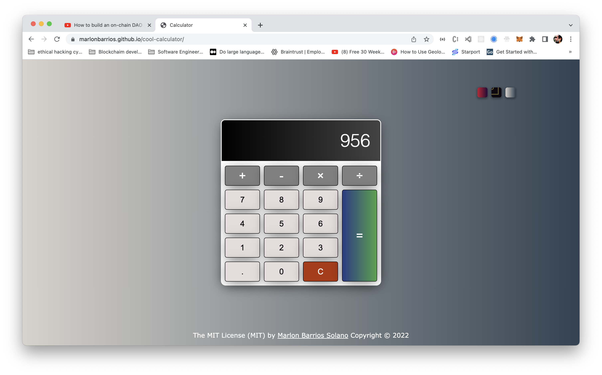](https://marlonbarrios.github.io/cool-calculator/)

[Simple Calculator LIVE](https://marlonbarrios.github.io/cool-calculator/ 'Simple Calculator')

[Simple Calculator REPO](https://github.com/marlonbarrios/cool-calculator 'Simple Calculator')

## JavaScript Video Player

Building a video player from scratch with code is something that don't do often. Empowering!! and a cool dance video! of course...

#javascriptdeveloper #javascript #oneprojectaday

[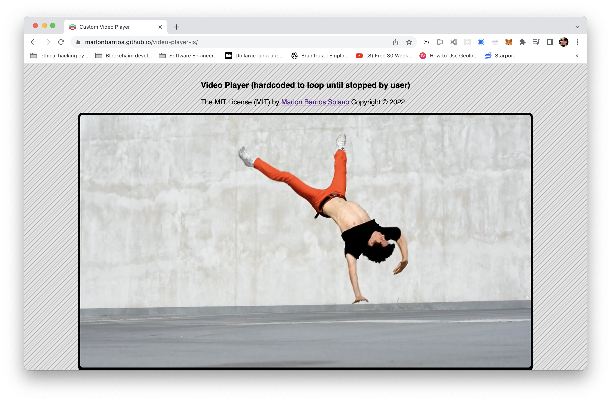](https://marlonbarrios.github.io/video-player-js/)

[JavaScript Video Player LIVE](https://marlonbarrios.github.io/video-player-js/ 'JavaScript Video Player')

[JavaScript Video Player REPO](https://github.com/marlonbarrios/video-player-js 'JavaScript Video Player') 

## Kanban Board 

I am amazed by the power and flexibility of the good old #html amplified by #vanillajs and beautified by #css3 ...I built this kanban style board Trello Inspired. Back to basics has been so fruitful...drag and drop!!
Try it!!

#javascript #javascriptdeveloper #webdevelopment

[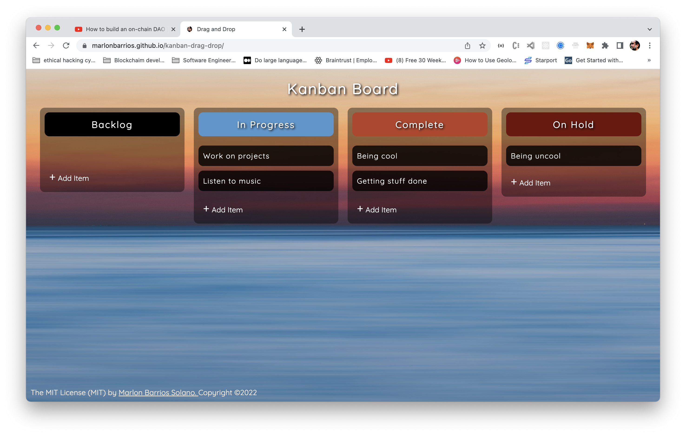](https://marlonbarrios.github.io/kanban-drag-drop/)

[Kanban Board LIVE](https://marlonbarrios.github.io/kanban-drag-drop/ 'Kanban Board API')

[Kanban Board REPO](https://github.com/marlonbarrios/kanban-drag-drop 'Kanban Board API')

## PaintR

Experimented with the power of the HTML Canvas element and #vanillajs (jscolor.js) or create a paint tool app: PaintR. The user can select and change the background color, the thickness of the brush, the paint color, erase, reset the canvas, save in local storage and export the 'master pieces' as jpegs to the local computer. Have Fun!

#javascript #html #webdevelopment 

[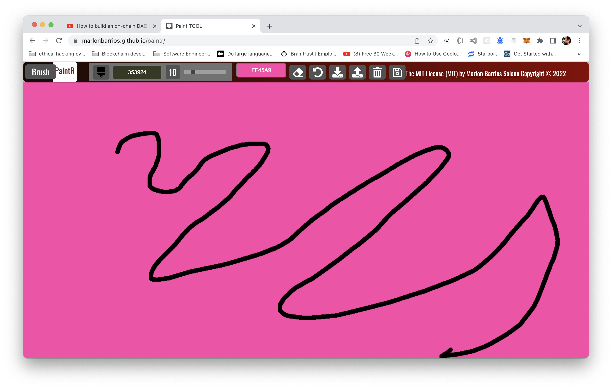](https://marlonbarrios.github.io/paintr/)

[PaintR LIVE](https://marlonbarrios.github.io/paintr/ 'PaintR')

[PaintR REPO](https://github.com/marlonbarrios/paintr 'PaintR')

## Quote Generator

Fun with APIs.
Gratitude is the fairest blossom which springs from the soul. - Henry Beecher  - I developed this Quotes Generator App  
 #javascript #javascriptdeveloper #codinglife

[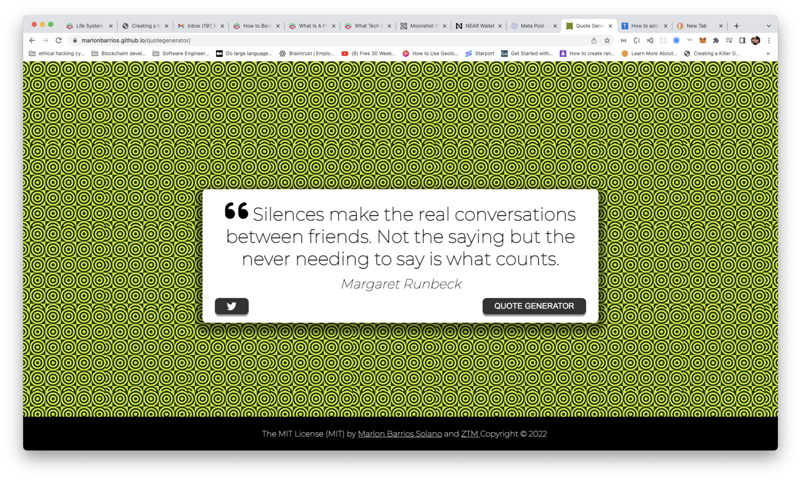](https://marlonbarrios.github.io/quotegenerator/)

[Quote Generator LIVE](https://marlonbarrios.github.io/quotegenerator/ 'Quote Generator')

[Quote Generator REPO](https://github.com/marlonbarrios/quotegenerator/ 'Quote Generator')

## Infinite Scroll

Creating the illusion of infinite scrolling with JavaScript and unsplash api.

#javascriptdeveloper #project #infinitescrolling

[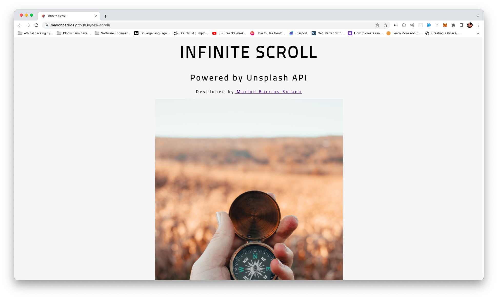](https://marlonbarrios.github.io/quotegenerator/)

[Photo Infinite Scroll LIVE](https://marlonbarrios.github.io/quotegenerator/ 'Photo Infinite Scroll')

[Photo Infinite Scroll  REPO](https://github.com/marlonbarrios/quotegenerator/ 'Photo Infinite Scroll')

## Video Player as Picture in Picture

The user can pop up the YouTube video as a separate floating window... picture in picture! Of course enjoying the fabulous Mon Laferte! #video

#github #javascript #oneprojectaday

[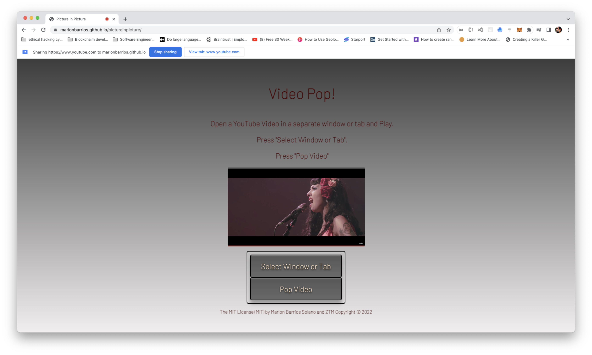](https://marlonbarrios.github.io/pictureinpicture/)

[Picture in Picture video player LIVE](https://marlonbarrios.github.io/pictureinpicture/ 'Picture in Picture video player LIVE')

[Picture in Picture video player REPO](https://github.com/marlonbarrios/pictureinpicture 'Picture in Picture video player LIVE')

## Funny Bot!

I made this cool and cute Robot Joke Teller. She is very self-centered and only tells jokes about programming. (JokesAPI and VoiceRSS API). 

#javascriptdeveloper #javascript #texttospeech #programming #oneprojectaday

[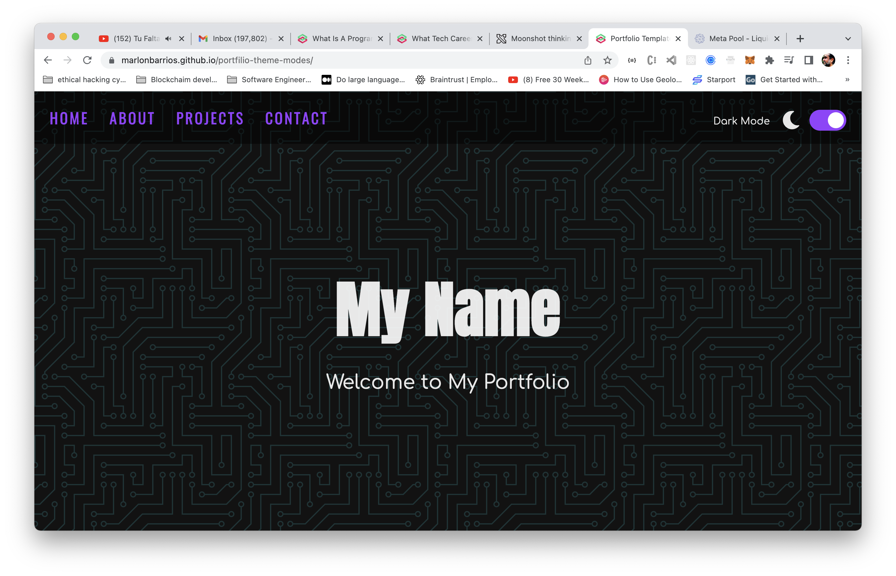](https://marlonbarrios.github.io/jokebot/)

[Funny Bot LIVE](https://marlonbarrios.github.io/jokebot/ 'Funny Bot ')

[Funny Bot REPO](https://github.com/marlonbarrios/jokebot 'Funny Bot ') 

## Theme Animations

I felt like a choreographer creating animation for this  website template. It was nice and elegant already (Creative Tim template), but now the user's gaze is driven by the choreography of the elements.

#animation #javascript #oneprojectaday #webdevelopment

[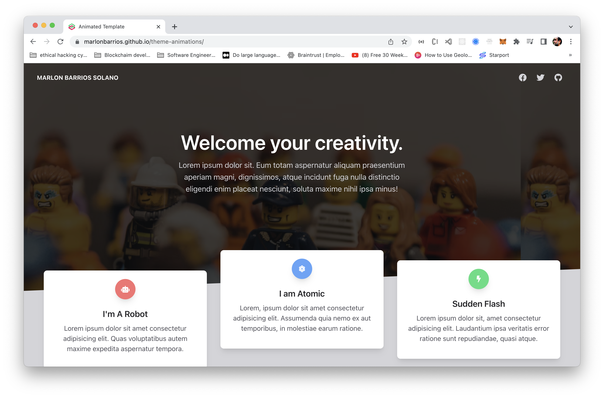](https://marlonbarrios.github.io/theme-animations/)

[Theme Animations LIVE](https://marlonbarrios.github.io/theme-animations/ 'Theme Animations')

[Theme Animations REPO](https://github.com/marlonbarrios/theme-animations 'Theme Animations ') 

## Animated Navigation

Adding an animated navigation bar to a portfolio site that is also mobile responsive. I had fun with  the color palate inspired  by my VSCode. #javascript Very bold colors! I may use this for my portfolio.

#javascriptdeveloper #vanillajs #webdevelopment #oneprojectaday #frontenddeveloper

[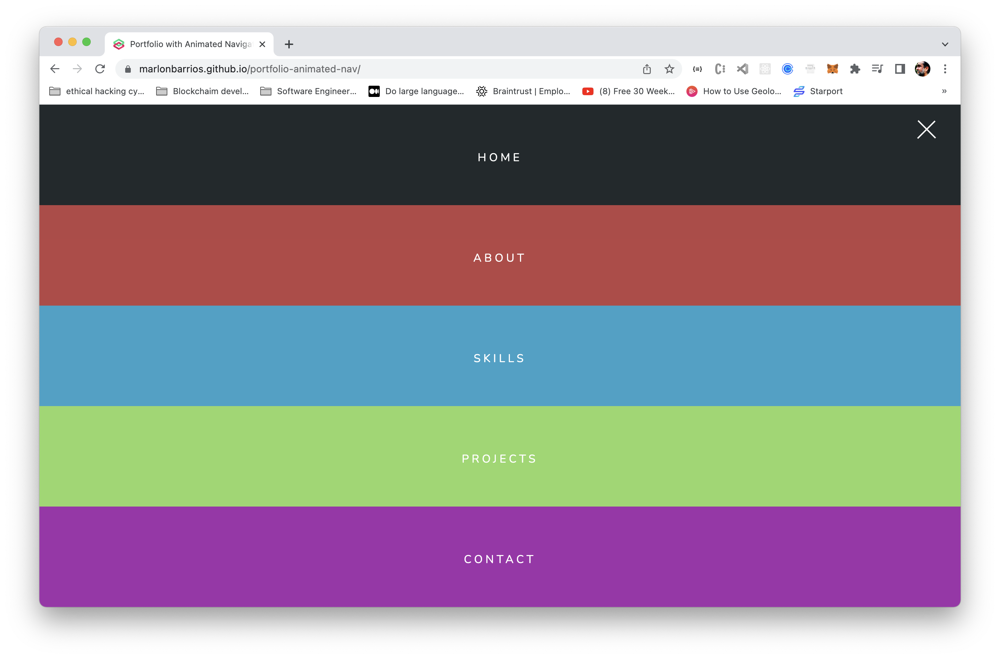](https://marlonbarrios.github.io/portfolio-animated-nav/)

[Portfolio Animated Navigation LIVE](https://marlonbarrios.github.io/portfolio-animated-nav/ 'Portfolio Animated Navigation ')

[Portfolio Animated Navigation  REPO](https://github.com/marlonbarrios/portfolio-animated-nav 'Portfolio Animated Navigation ') 

## Music Player

I worked hard on this audio player managed by JS for a web3 project... 

#javascript #project #audioplayer #webdevelopment #sofware #frontend

[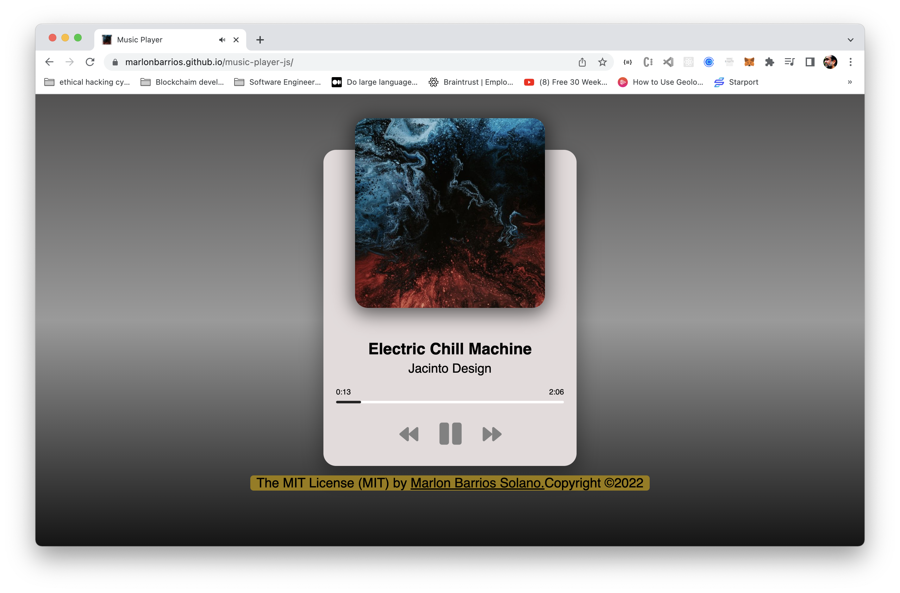](https://marlonbarrios.github.io/music-player-js/)

[Music Player LIVE](https://marlonbarrios.github.io/music-player-js/ 'Music Player ')

[Music Player  REPO](https://github.com/marlonbarrios/music-player-jses 'Music Player') 

## Countdown

Worked the functionality of a date countdown in #javascript and added video as a background. I also implemented local storage
#webdevelopment #vanillajs

[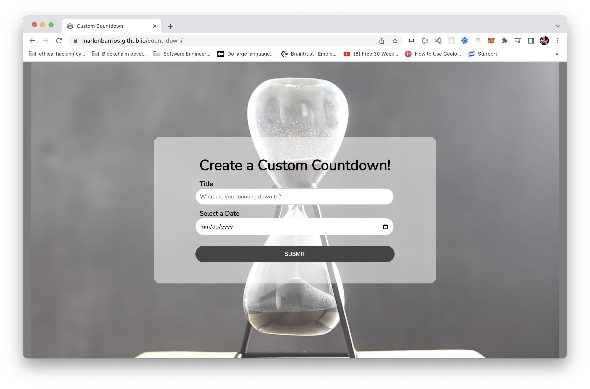](https://marlonbarrios.github.io/count-down/)

[Countdown LIVE](https://marlonbarrios.github.io/count-down/ 'Countdown')

[Countdown REPO](https://github.com/marlonbarrios/count-down 'Countdown') 

## Bookmarking Sites

This app locally bookmarks websites and places them in order. The user can delete them and its mobile responsive.

[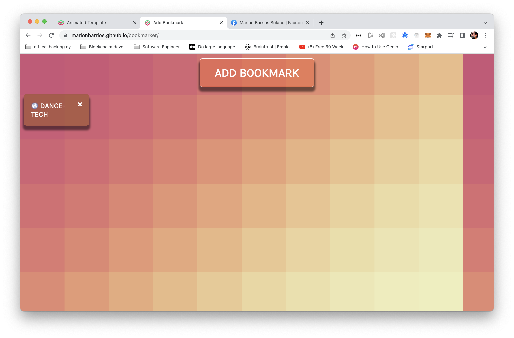](https://marlonbarrios.github.io/bookmarker/)

[Bookmarking Site LIVE](https://marlonbarrios.github.io/bookmarker/ 'Bookmarking Site')

[Bookmarking Site REPO](https://github.com/marlonbarrios/bookmarker/ 'Bookmarking Site')

## Form Validators
Back to basics... form validation with HTML5 and a bit of #vanillajs help.

#oneprojectaday #javascript #webdevelopment #webdev

[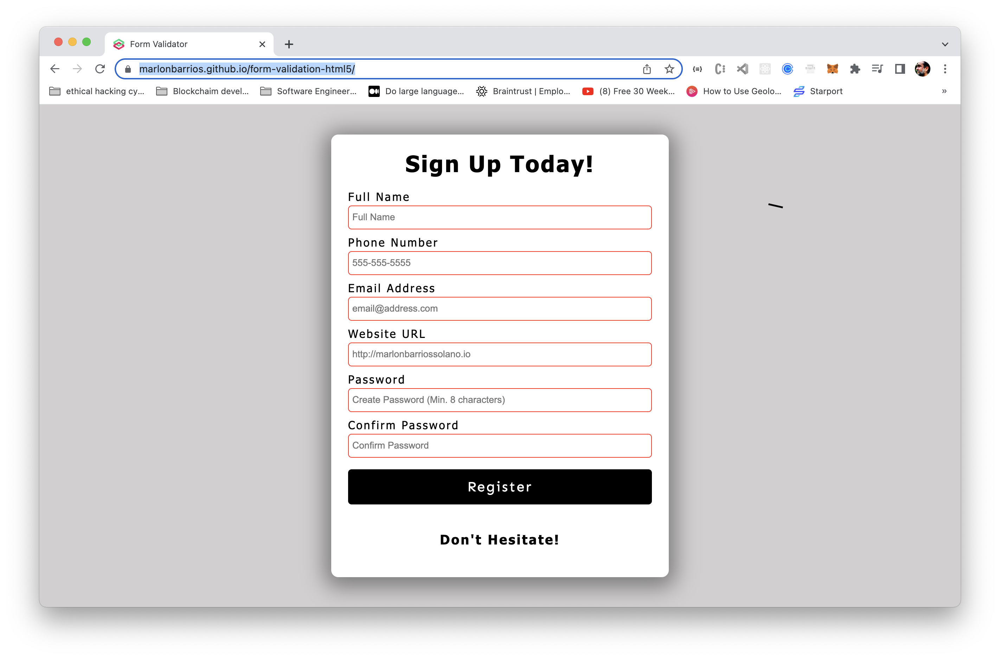](https://marlonbarrios.github.io/form-validation-html5/)

[Form Validator HTML5 LIVE](https://marlonbarrios.github.io/form-validation-html5/ 'Form Validator HTML5')

[Form Validator HTML5 REPO](https://github.com/marlonbarrios/form-validation-html5 'Form Validator HTML5')

## Rock Paper Scissors Lizard Spock

I built this game app with the logic proposed by Sheldon from "The Big Bang Theory': Rock paper Scissors Lizard Spock...It was fun and I gave a retro touch with #vanillajs confetti for the winners!

#javascript #webdevelopment #softwareengineer #oneprojectaday

[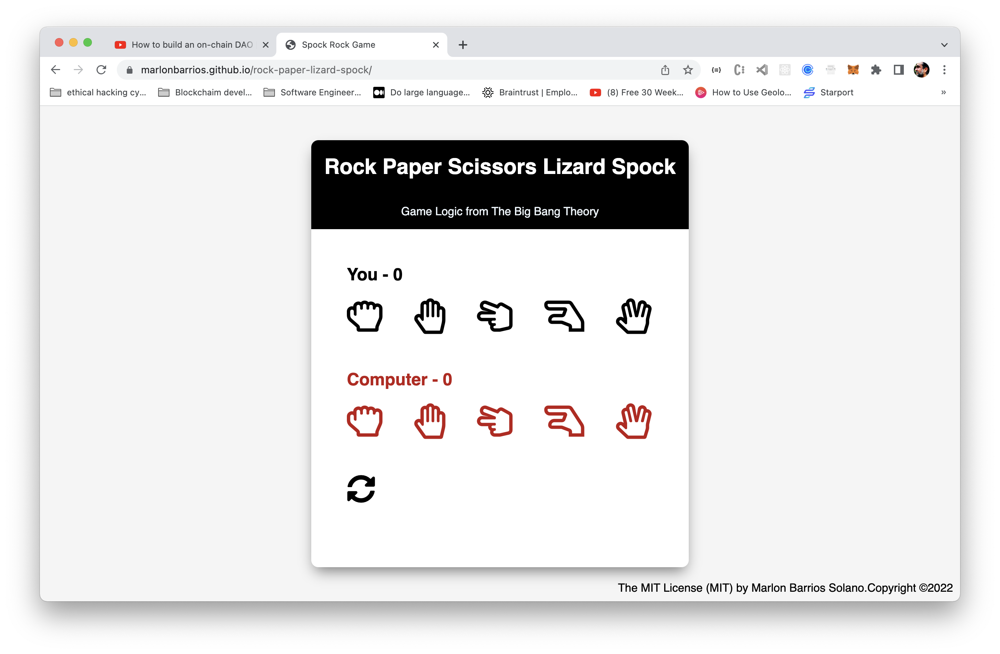](https://marlonbarrios.github.io/rock-paper-lizard-spock/)

[Rock Paper Scissors Lizard Spock Game LIVE](https://marlonbarrios.github.io/rock-paper-lizard-spock/ 'Rock Paper Scissors Lizard Spock Game')

[Rock Paper Scissors Lizard Spock Game REPO](https://github.com/marlonbarrios/rock-paper-lizard-spock 'Rock Paper Scissors Lizard Spock Game')

## NASA IMAGES API

I always wanted to build an app using the NASA API. Here it is: it loads NASA images, with their titles, image description and license info.The user can select favorites and they are kept in local storage. User can remove images from favorites. Fun with code and the universe...

#webdevelopment  #javascript #vanillajs #oneprojectaday

[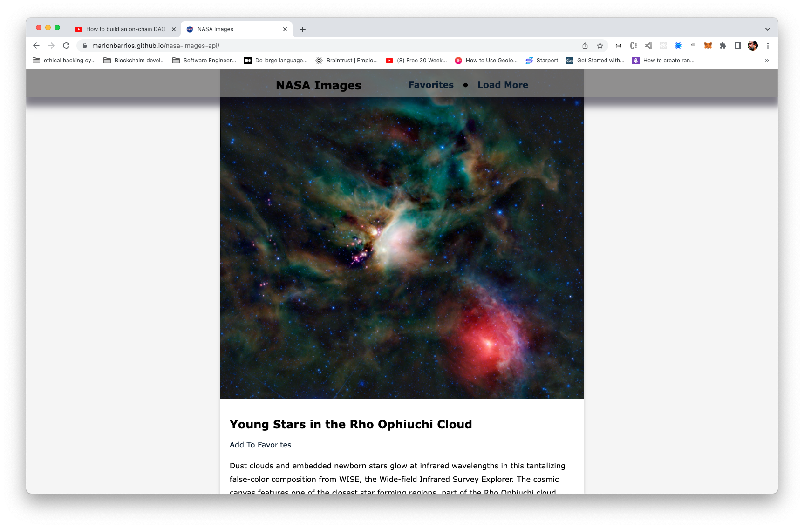](https://marlonbarrios.github.io/nasa-images-api/)

[NASA IMAGES API LIVE](https://marlonbarrios.github.io/nasa-images-api/ 'NASA IMAGES API')

[NASA IMAGES API REPO](https://github.com/marlonbarrios/nasa-images-api 'NASA IMAGES API')

## Classic Pong

Homage to the classic PONG game with the HTML canvas and #vanillajs to animate the ball and the players. You play against the computer moving the cursor and the bottom paddle; it keeps the score and the winner score is 7; repeat. Have fun!

#pong #webdev #game #js

[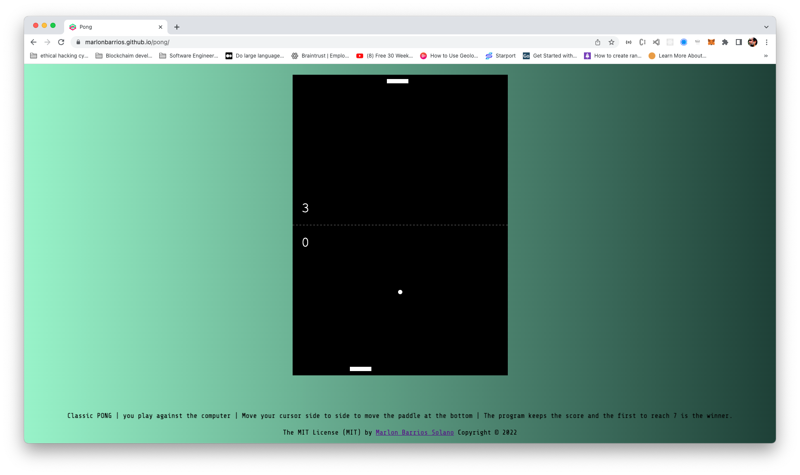](https://marlonbarrios.github.io/pong/)

[Classic PONG LIVE](https://marlonbarrios.github.io/pong/ 'Classic PONG')

[Classic PONG REPO](https://github.com/marlonbarrios/pong 'Classic PONG')

